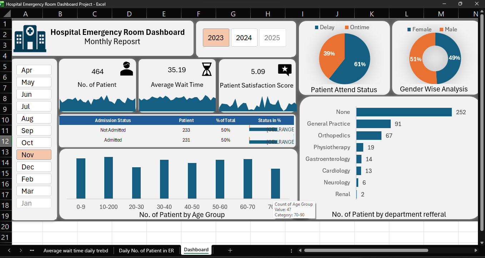

# 🏥 Hospital Emergency Room Dashboard (Excel)

## 📌 Project Overview

This project presents an interactive **Hospital Emergency Room Dashboard** developed in **Microsoft Excel**.

The dashboard transforms raw hospital emergency room data into meaningful visual insights, helping healthcare stakeholders monitor patient flow, operational efficiency, wait times, admissions, and department referrals.

The objective is to support data-driven decision making and improve emergency room performance.

---

# Dashboard Preview



---

# Raw Dataset Preview


.png)

---

# Business Problem

Hospitals receive hundreds of emergency room patients every day.

Without proper reporting, it becomes difficult to answer questions like:

- How many patients visited today?
- What is the average waiting time?
- Are patients being attended within the target time?
- Which departments receive the highest referrals?
- What is the patient satisfaction score?
- Which age groups visit the ER most frequently?

This dashboard solves these challenges through interactive reporting.

---

# Project Objectives

- Analyze emergency room performance
- Monitor patient admission status
- Track patient waiting time
- Evaluate patient satisfaction
- Analyze gender distribution
- Study patient age groups
- Identify department referral trends
- Enable monthly and yearly analysis

---

# KPI Metrics

### 👥 Number of Patients

Total number of emergency room patients.

---

### ⏱ Average Wait Time

Average waiting time before a patient is attended by medical staff.

---

### ⭐ Patient Satisfaction Score

Average satisfaction rating provided by patients.

---

# Dashboard Features

✔ Interactive Month Slicer

✔ Year Filter

✔ Dynamic KPIs

✔ Sparklines

✔ Pivot Tables

✔ Pivot Charts

✔ Clean Dashboard Design

---

# Charts Included

## Patient Admission Status

Displays:

- Admitted Patients
- Not Admitted Patients

---

## Patient Age Distribution

Patients grouped into different age ranges.

---

## Timeliness Analysis

Percentage of patients attended within **30 minutes**.

---

## Gender Analysis

Distribution of Male and Female patients.

---

## Department Referral Analysis

Departments receiving the highest patient referrals.

Examples:

- General Practice
- Orthopedics
- Cardiology
- Neurology
- Gastroenterology
- Physiotherapy
- Renal

---

# Tools Used

- Microsoft Excel
- Pivot Tables
- Pivot Charts
- Slicers
- Sparklines
- Conditional Formatting
- Excel Formulas

---

# Skills Demonstrated

- Data Cleaning
- Data Analysis
- Dashboard Design
- Data Visualization
- Business Intelligence
- KPI Reporting
- Interactive Reporting

---

# Insights

- Balanced admission and non-admission rates
- Average waiting time monitored through KPI
- Patient satisfaction trends tracked daily
- Department referrals identified for operational planning
- Age group distribution helps understand patient demographics
- Gender analysis provides population insights

---

# Project Files

```
Hospital-Emergency-Room-Dashboard-Excel
│
├── Dashboard.xlsx
├── README.md
│
└── Images
    ├── Dashboard.png
    └── Raw_Data.png
```

---

# Future Improvements

- Power BI Version
- SQL Integration
- Power Query Automation
- Dynamic Forecasting
- Advanced Healthcare KPIs

---

# Connect With Me

If you found this project useful, feel free to ⭐ the repository and connect with me on LinkedIn.
